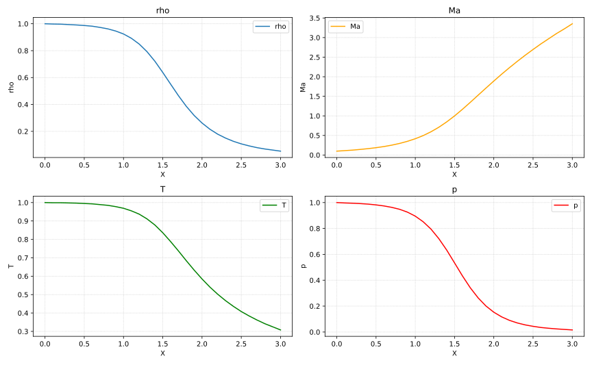

# Anderson's CFD Chap7(C++)

这个仓库是安德森《计算流体力学基础及其应用》第7章算例的C++实现。

包含三个程序`P1DNozzle_1.cpp`,`P1DNozzle_2.cpp`,`P1DNozzle_3.cpp`,分别对应非守恒型控制方程，守恒型控制方程以及激波捕捉法。

这是书中第一个算例，也是相对最简单的算例。容易验证计算结果和作者给出的参考值吻合。

## 计算结果展示

